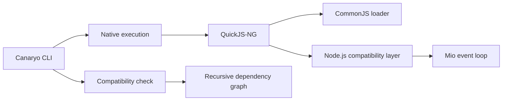

<table align="center">
  <tr>
    <td align="center" bgcolor="#0d1117">
      
    </td>
  </tr>
</table>

<h1 align="center">Canaryo</h1>

<p align="center">
  <strong>A lightweight JavaScript runtime for existing Node.js HTTP applications.</strong>
</p>

<p align="center">
  <code>node server.js</code> → <code>canaryo server.js</code>
</p>

<p align="center">
  
  
  
</p>

Canaryo embeds QuickJS-NG in a Rust executable and recreates the Node.js APIs needed by HTTP applications. Its goal is to run existing projects without source changes while reducing startup time and memory usage.

Canaryo 0.1.0 is an experimental runtime. Basic `node:http`, Express 5.2.1, and Fastify 5.12.3 applications work natively; broader Node.js compatibility is under active development.

## Why Canaryo?

- **Existing code first:** run supported CommonJS applications without rewriting them.
- **Small memory footprint:** the current Express fixture uses about 10.4 MiB of resident memory with 16 persistent connections.
- **Fast startup:** native HTTP starts in about 10 ms and the tested Express application starts faster than Node.js on the benchmark machine.
- **Compatibility report:** inspect an entry point and its dependencies before execution.
- **Explicit escape hatch:** delegate to the installed Node.js runtime when necessary.

## Quick start

Install Canaryo from this checkout:

```sh
cargo install --path .
```

Install your application's packages, inspect compatibility, and run it:

```sh
npm install
canaryo check server.js
canaryo server.js
```

A minimal server needs no Canaryo-specific code:

```js
const http = require("node:http");

http.createServer((_request, response) => {
    response.end("Hello from Canaryo!");
}).listen(3000);
```

The supported Fastify subset also uses the framework's regular API:

```js
const fastify = require("fastify")();

fastify.get("/", async () => ({ hello: "world" }));
fastify.listen({ port: 3000, host: "127.0.0.1" });
```

## CLI

| Command | Purpose |
|---|---|
| `canaryo <file> [args...]` | Run a JavaScript entry point with the native runtime. |
| `canaryo run <file> [args...]` | Explicit form of the native run command. |
| `canaryo check <file>` | Analyze local and package dependencies recursively. |
| `canaryo run --node <file> [args...]` | Run through the installed Node.js executable. |
| `canaryo --version` | Print the Canaryo version. |

Execution starts directly for low startup overhead. Use `canaryo check` in development or CI when you want the complete compatibility report.

## Performance

Latest local results on Windows 11, a Ryzen 5 5600X, and Node.js 22.15.1:

| Scenario | Node.js | Canaryo | Difference |
|---|---:|---:|---:|
| `node:http` startup | 54.83 ms | 21.55 ms | 60.7% lower |
| Express startup | 218.57 ms | 178.58 ms | 18.3% lower |
| Fastify startup | 361.39 ms | 213.63 ms | 40.9% lower |
| Express, new connections × 16 | 2,279 req/s | 3,211 req/s | 40.9% higher |
| Fastify, new connections × 16 | 4,166 req/s | 5,119 req/s | 22.9% higher |
| Express, keep-alive × 16 | 6,318 req/s | 6,476 req/s | 2.5% higher |
| Fastify, keep-alive × 16 | 20,528 req/s | 12,950 req/s | 36.9% lower |
| Fastify RSS, keep-alive × 16 | 53.9 MiB | 13.3 MiB | 75.3% lower |

Canaryo leads startup and memory use across the tested applications. It leads all three applications when connections are reopened for every request and leads `node:http` and Express with persistent connections at concurrency 16. Node.js remains faster for persistent Fastify traffic. These numbers measure the current compatibility surface on one machine, not every Node.js workload. See [BENCHMARKS.md](BENCHMARKS.md) for the complete results and methodology.

## How it works



- `src/runtime.rs` creates the JavaScript context, loads CommonJS, and caches resolutions.
- `src/modules.rs` implements Node-style file and package resolution.
- `src/http.rs` maps `node:http` calls to a non-blocking Rust event loop.
- `src/polyfills.js` provides the JavaScript-facing compatibility layer.
- `src/analyzer.rs` powers the recursive `check` command.

## Compatibility

| Area | Status | Current scope |
|---|---|---|
| CommonJS | Supported | Relative modules, JSON, package `main`, scoped packages, cache, and upward `node_modules` lookup. |
| `node:http` | Partial | Server creation, persistent HTTP/1.1 connections, pipelining, content-length and chunked request bodies, trailers, binary payloads, `HEAD`, socket metadata, response lifecycle events, status, headers, `write`, and `end`. |
| Express | Partial | Express 5.2.1 startup, basic routing, JSON request parsing, and JSON responses. |
| Fastify | Partial | Fastify 5.12.3 startup, parameterized routes, query strings, request/response hooks, JSON request parsing, async handlers, timed handlers, and JSON responses. Plugin compatibility varies with the Node.js APIs each plugin uses. |
| Promises and timers | Partial | Promise jobs, `AsyncResource`, `process.nextTick`, `queueMicrotask`, `setImmediate`, `setTimeout`, and `setInterval` in the native HTTP event loop. Standalone event-loop lifetime and timer handle behavior remain incomplete. |
| Buffers and streams | Partial | Buffer creation, byte lengths, concatenation, UTF-8 decoding, `StringDecoder`, and request body events required by the current framework fixtures. |
| Filesystem APIs | Partial | Initial synchronous compatibility methods. |
| ESM | Planned | Native `import` and `export` execution is not available yet. |
| Keep-alive | Supported | Connections persist by default on HTTP/1.1 and honor `Connection: close`. |
| TLS | Planned | HTTPS sockets and certificates are not available yet. |
| Native `.node` addons | Unsupported | Native Node.js ABI modules cannot be loaded. |

`canaryo check` reports one of three project-level outcomes:

- **Compatible:** no unsupported API was detected.
- **Compatible with limitations:** the application uses an API with partial support.
- **Incompatible:** the application requires functionality the runtime cannot execute.

## Development

Run the complete validation suite:

```sh
npm ci --prefix fixtures/express-basic
npm ci --prefix fixtures/fastify-basic
cargo fmt --check
cargo clippy --all-targets -- -D warnings
cargo test
cargo test --test runtime_smoke -- --ignored
```

Reproduce the performance comparison:

```sh
cargo build --release
cargo bench --bench runtime -- --duration 3 --runs 3 --startup-runs 7
cargo bench --bench runtime -- --keep-alive --duration 3 --runs 3 --startup-runs 7
```

Add `--case fastify`, `--case express`, or `--case node:http` to isolate one application while investigating performance.

Use `--startup-only` while working specifically on initialization:

```sh
cargo bench --bench runtime -- --startup-only --startup-runs 15
```

## Roadmap

- Connection timeouts, limits, backpressure, and graceful shutdown.
- Streaming request and response bodies.
- Additional asynchronous I/O sources and complete timer lifecycle behavior.
- Wider Buffer, stream, filesystem, crypto, and networking support.
- Native ESM execution and package `exports` resolution.
- A larger Express, Fastify, and plugin compatibility suite.
- TLS, workers, diagnostics, and production observability.

## License

Canaryo is available under the [MIT License](LICENSE).
