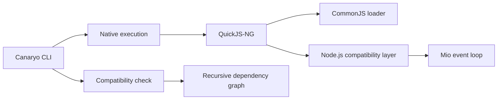

<table align="center">
  <tr>
    <td align="center" bgcolor="#0d1117">
      
    </td>
  </tr>
</table>

<h1 align="center">Canaryo</h1>

<p align="center">
  <strong>A lightweight JavaScript runtime for existing Node.js HTTP applications.</strong>
</p>

<p align="center">
  <code>node server.js</code> → <code>canaryo server.js</code>
</p>

<p align="center">
  
  
  
</p>

Canaryo embeds QuickJS-NG in a Rust executable and recreates the Node.js APIs needed by HTTP applications. Its goal is to run existing projects without source changes while reducing startup time and memory usage.

Canaryo 0.1.0 is an experimental runtime. Basic `node:http` and Express 5.2.1 applications work natively; broader Node.js compatibility is under active development.

## Why Canaryo?

- **Existing code first:** run supported CommonJS applications without rewriting them.
- **Small memory footprint:** the current Express fixture uses about 10.6 MiB of resident memory with 16 persistent connections.
- **Fast startup:** native HTTP starts in about 10 ms and the tested Express application starts faster than Node.js on the benchmark machine.
- **Compatibility report:** inspect an entry point and its dependencies before execution.
- **Explicit escape hatch:** delegate to the installed Node.js runtime when necessary.

## Quick start

Install Canaryo from this checkout:

```sh
cargo install --path .
```

Install your application's packages, inspect compatibility, and run it:

```sh
npm install
canaryo check server.js
canaryo server.js
```

A minimal server needs no Canaryo-specific code:

```js
const http = require("node:http");

http.createServer((_request, response) => {
    response.end("Hello from Canaryo!");
}).listen(3000);
```

## CLI

| Command | Purpose |
|---|---|
| `canaryo <file> [args...]` | Run a JavaScript entry point with the native runtime. |
| `canaryo run <file> [args...]` | Explicit form of the native run command. |
| `canaryo check <file>` | Analyze local and package dependencies recursively. |
| `canaryo run --node <file> [args...]` | Run through the installed Node.js executable. |
| `canaryo --version` | Print the Canaryo version. |

Execution starts directly for low startup overhead. Use `canaryo check` in development or CI when you want the complete compatibility report.

## Performance

Latest local results on Windows 11, a Ryzen 5 5600X, and Node.js 22.15.1:

| Scenario | Node.js | Canaryo | Difference |
|---|---:|---:|---:|
| `node:http` startup | 52.88 ms | 9.99 ms | 81.1% lower |
| Express startup | 193.14 ms | 152.82 ms | 20.9% lower |
| Express, new connections × 16 | 3,584 req/s | 4,299 req/s | 20.0% higher |
| Express, keep-alive × 1 | 6,371 req/s | 5,256 req/s | 17.5% lower |
| Express, keep-alive × 16 | 6,359 req/s | 6,584 req/s | 3.5% higher |
| Express RSS, keep-alive × 16 | 88.4 MiB | 10.6 MiB | 88.0% lower |

Canaryo leads the concurrent keep-alive test but Node.js remains faster with one persistent Express connection. These numbers measure the current compatibility surface on one machine, not every Node.js workload. See [BENCHMARKS.md](BENCHMARKS.md) for the complete results and methodology.

## How it works



- `src/runtime.rs` creates the JavaScript context, loads CommonJS, and caches resolutions.
- `src/modules.rs` implements Node-style file and package resolution.
- `src/http.rs` maps `node:http` calls to a non-blocking Rust event loop.
- `src/polyfills.js` provides the JavaScript-facing compatibility layer.
- `src/analyzer.rs` powers the recursive `check` command.

## Compatibility

| Area | Status | Current scope |
|---|---|---|
| CommonJS | Supported | Relative modules, JSON, package `main`, scoped packages, cache, and upward `node_modules` lookup. |
| `node:http` | Partial | Server creation, persistent HTTP/1.1 connections, pipelining, request metadata and body, response status, headers, `write`, and `end`. |
| Express | Partial | Express 5.2.1 startup, basic routing, and JSON responses. |
| Buffers and streams | Partial | Compatibility methods required by the current Express fixture. |
| Filesystem APIs | Partial | Initial synchronous compatibility methods. |
| ESM | Planned | Native `import` and `export` execution is not available yet. |
| Keep-alive | Supported | Connections persist by default on HTTP/1.1 and honor `Connection: close`. |
| TLS | Planned | HTTPS sockets and certificates are not available yet. |
| Native `.node` addons | Unsupported | Native Node.js ABI modules cannot be loaded. |

`canaryo check` reports one of three project-level outcomes:

- **Compatible:** no unsupported API was detected.
- **Compatible with limitations:** the application uses an API with partial support.
- **Incompatible:** the application requires functionality the runtime cannot execute.

## Development

Run the complete validation suite:

```sh
npm ci --prefix fixtures/express-basic
cargo fmt --check
cargo clippy --all-targets -- -D warnings
cargo test
cargo test --test runtime_smoke -- --ignored
```

Reproduce the performance comparison:

```sh
cargo build --release
cargo bench --bench runtime -- --duration 3 --runs 3 --startup-runs 7
cargo bench --bench runtime -- --keep-alive --duration 3 --runs 3 --startup-runs 7
```

Use `--startup-only` while working specifically on initialization:

```sh
cargo bench --bench runtime -- --startup-only --startup-runs 15
```

## Roadmap

- Connection timeouts, limits, backpressure, and graceful shutdown.
- Streaming request and response bodies.
- A real asynchronous event loop for timers, I/O, and promises.
- Wider Buffer, stream, filesystem, crypto, and networking support.
- Native ESM execution and package `exports` resolution.
- Fastify and a larger package compatibility suite.
- TLS, workers, diagnostics, and production observability.

## License

Canaryo is available under the [MIT License](LICENSE).
