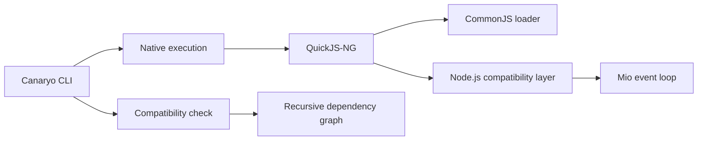

<div align="center">
  
</div>

<h1 align="center">Canaryo</h1>

<p align="center">
  <strong>A Rust and QuickJS proof of concept for existing Express applications.</strong>
</p>

<p align="center">
  <code>node server.js</code> → <code>canaryo server.js</code>
</p>

<p align="center">
  
  
  
</p>

Canaryo embeds QuickJS-NG in a Rust executable and recreates the Node.js APIs needed by a focused set of HTTP applications. It demonstrates that an existing Express application can run without source changes while using a small native runtime.

Canaryo 0.2.0 is the completed one-week Express 5.2.1 compatibility profile built from the initial 0.1.0 proof of concept. It is not a production runtime or an attempt to implement every Node.js API.

## Why Canaryo?

- **Existing code first:** run supported CommonJS applications without rewriting them.
- **Small memory footprint:** the current Express fixture uses about 12.5 MiB of resident memory with 16 persistent connections.
- **Fast startup:** native HTTP starts in about 25 ms and the tested Express application starts faster than Node.js on the benchmark machine.
- **Compatibility report:** inspect an entry point and its dependencies before execution.
- **Explicit escape hatch:** delegate to the installed Node.js runtime when necessary.

## Quick start

Install Canaryo from this checkout:

```sh
cargo install --path .
```

Tagged releases provide Windows x86-64 and Linux x86-64 archives with SHA-256 checksum files. The archives contain the executable, documentation, logo, and MIT license.

Install your application's packages, inspect compatibility, and run it:

```sh
npm install
canaryo check server.js
canaryo server.js
```

A minimal Express server needs no Canaryo-specific code:

```js
const express = require("express");
const app = express();

app.get("/", (_request, response) => {
    response.json({ hello: "Canaryo" });
});

app.listen(3000);
```

## CLI

| Command | Purpose |
|---|---|
| `canaryo <file> [args...]` | Run a JavaScript entry point with the native runtime. |
| `canaryo run <file> [args...]` | Explicit form of the native run command. |
| `canaryo check <file>` | Analyze local and package dependencies recursively. |
| `canaryo run --node <file> [args...]` | Run through the installed Node.js executable. |
| `canaryo --version` | Print the Canaryo version. |

Execution starts directly for low startup overhead. Use `canaryo check` in development or CI when you want the complete compatibility report.

## Performance

Results collected on Windows 11 with an AMD Ryzen 5 5600X, Node.js 22.15.1, Bun 1.4.2, and a release build of Canaryo 0.1.0. Every load result is the median of three 3-second samples after warm-up; all measured requests completed without errors.

### Startup latency

Lower is better.

| Application | Node.js | Bun | Canaryo |
|---|---:|---:|---:|
| `node:http` | 50.90 ms | 51.30 ms | **25.24 ms** |
| Express 5.2.1 | 218.48 ms | **171.33 ms** | 198.14 ms |

### Throughput at concurrency 16

Higher is better. "New connection" opens a TCP connection for every request; "keep-alive" reuses one connection per worker.

| Application | New: Node.js | New: Bun | New: Canaryo | Keep-alive: Node.js | Keep-alive: Bun | Keep-alive: Canaryo |
|---|---:|---:|---:|---:|---:|---:|
| `node:http` | 6,461 | 7,183 | **7,365** | 20,220 | **25,732** | 19,006 |
| Express 5.2.1 | 3,250 | **6,253** | 3,630 | 6,019 | **16,860** | 5,313 |

### 16 KiB JSON throughput at concurrency 16

This test sends `POST /echo` over persistent connections and includes parsing and returning the request body.

| Application | Node.js | Bun | Canaryo | Node.js RSS | Bun RSS | Canaryo RSS |
|---|---:|---:|---:|---:|---:|---:|
| `node:http` | 10,343 req/s | **10,643 req/s** | 7,999 req/s | 41.3 MiB | 43.6 MiB | **9.2 MiB** |
| Express 5.2.1 | 3,038 req/s | **6,493 req/s** | 1,797 req/s | 84.3 MiB | 62.3 MiB | **13.0 MiB** |

### Resident memory at concurrency 16

Lower is better. RSS is sampled from the runtime process during the selected throughput run.

| Application | New: Bun | New: Canaryo | Reduction | Keep-alive: Bun | Keep-alive: Canaryo | Reduction |
|---|---:|---:|---:|---:|---:|---:|
| `node:http` | 47.6 MiB | **9.8 MiB** | **79.4%** | 47.3 MiB | **9.8 MiB** | **79.3%** |
| Express 5.2.1 | 59.1 MiB | **12.9 MiB** | **78.2%** | 54.7 MiB | **12.6 MiB** | **77.0%** |

Canaryo starts native HTTP 50.8% faster than Bun and uses 77.0% to 79.4% less resident memory across the concurrency-16 GET workloads shown here. It also leads Bun's native HTTP result by 2.5% when each request opens a connection. Bun leads the persistent and Express-heavy workloads because JavaScriptCore's optimizing JIT accelerates repeated application code.

These synthetic loopback results cover the current compatibility surface on one machine. See [BENCHMARKS.md](BENCHMARKS.md) for latency percentiles, concurrency 1 results, methodology, limitations, and reproduction commands.

## How it works



- `src/runtime.rs` creates the JavaScript context, loads CommonJS, and caches resolutions.
- `src/modules.rs` implements Node-style file and package resolution.
- `src/http.rs` maps `node:http` calls to a non-blocking Rust event loop.
- `src/polyfills/` provides the JavaScript-facing compatibility layer, split into ordered subsystem fragments.
- `src/analyzer.rs` powers the recursive `check` command.

## Compatibility

| Area | Status | Current scope |
|---|---|---|
| CommonJS | Supported | Relative modules, JSON, package `main` and `exports`, conditional and wildcard exports, scoped packages, cache, upward `node_modules` lookup, common `node:module` helpers, legacy `sys` and `_stream_*` aliases, and direct built-in subpaths such as `assert/strict`, `path/posix`, `path/win32`, and `util/types`. |
| `node:http` | Partial | Non-blocking servers, exported server/message class hierarchies, persistent HTTP/1.1 connections, pipelining, incrementally delivered request bodies with socket backpressure, chunk extensions and trailers, binary payloads, `HEAD`, response lifecycle, validated headers, header appending and bulk setting, connection admission limits, graceful close, idle/forced connection closing, configurable request limits, plus outbound `request` and `get`. Outbound uploads and responses stream through bounded queues and support pause/resume, timeouts, explicit aborts, and `AbortSignal`. `Agent` provides isolated pools, keep-alive, socket limits, `maxFreeSockets`, `agent: false`, `getName`, and pool destruction. Responses with redirects are delivered as 3xx, matching Node. Advanced socket creation and live pool introspection remain incomplete. |
| Express | Profile | Express 5.2.1 startup, routing, parameters, queries, mounted routers, synchronous and asynchronous handlers, middleware and error-handler ordering, JSON, URL-encoded, text and raw body parsers, static files, cookies, redirects and common request/response helpers. Verified middleware: compression 1.8.2, cors 2.8.5, cookie-parser 1.4.7 and memory-backed single-file uploads with multer 2.0.2. Arbitrary middleware is not implied. |
| Async context and timers | Partial | Promise jobs, `AsyncLocalStorage`, `AsyncResource`, resource lifecycle hooks and IDs, `process.nextTick`, `queueMicrotask`, callback timers, and `node:timers/promises` timeout, immediate, interval, and scheduler APIs. Async-local stores propagate through timers, ticks, Promise callbacks, and resource bindings. Referenced timers keep standalone scripts alive, while `unref()` permits exit. Precise Node scheduling phases and hooks for every internal resource remain incomplete. |
| Process and console | Partial | Importable `node:process`, `node:console`, and `node:tty`; arguments, environment and env-file loading, cwd and directory changes, executable path, PID, platform/architecture/version metadata, exit codes and explicit termination, process events, warnings, uptime, `hrtime`, resource-shape methods, built-in module lookup, host TTY detection, evented standard streams, color capability helpers, console assertions, counters, groups and timers, and custom `Console` streams. Signals, IPC, privilege APIs, interactive stdin reads, terminal sizing, advanced console formatting, and exact resource accounting remain incomplete. |
| Events | Partial | Global `Event`, `EventTarget`, `AbortController`, and `AbortSignal`; listener ordering, one-time and prepended listeners, removal, introspection, global and per-emitter listener limits, monitored and unhandled errors, `captureRejections`, `EventEmitterAsyncResource`, `addAbortListener`, cancelable Promise-based `events.once`, and cancelable async iteration through `events.on`. Listener leak warnings remain incomplete. |
| Diagnostics | Partial | Named `node:diagnostics_channel` channels and the public `Channel` class support publication, subscription, unsubscription, subscriber checks, `AsyncLocalStorage` store binding, and tracing of synchronous, Promise, and callback operations. Bounded channels and exact subscriber snapshot semantics remain incomplete. |
| Performance hooks | Partial | Monotonic process-relative timing, marks, measures, entry lookup and cleanup, observers, function timing, event-loop utilization shape, and recordable histograms. Native event-loop delay sampling, garbage-collection entries, and exact Node bootstrap milestones remain incomplete. |
| URLs | Partial | Global and `node:url` `URL`/`URLSearchParams`, repeated query parameters, relative HTTP URLs, and basic file URL conversion. IDNA, complete percent-encoding rules, and every legacy URL edge case remain incomplete. |
| Fetch APIs | Partial | Global `fetch` uses the native HTTP/HTTPS clients and supports streamed responses, request bodies, redirects, abort signals, `Headers`, `Request`, and `Response` values, plus URL-encoded and multipart `FormData` with files. Streaming request uploads, cookies, proxy settings, and exact Fetch specification validation remain incomplete. |
| DNS and IP utilities | Partial | System-backed `dns.lookup`, IPv4/IPv6 filtering, all-results and Promise forms, basic `resolve4`/`resolve6`, result ordering, public lookup flags and error constants, and `net.isIP` helpers. Full DNS record types and custom resolvers remain incomplete. |
| TCP networking | Partial | Non-blocking `net.createServer`, asynchronous `connect`/`createConnection`, concurrent duplex `Socket` streams, incremental reads and writes, half-close, byte counters, addresses, timeouts, connection lifecycle events, graceful server close, IP block lists, and parsed socket addresses. IPC, dynamic socket options, connection admission limits, and socket-level backpressure remain incomplete. |
| Operating system APIs | Partial | Host platform, architecture, type, endianness, home/temp directories, hostname, CPU parallelism, user shape, EOL, and uptime. Exact CPU, memory, release, network-interface, and OS constants data remain incomplete. |
| Path APIs | Partial | Platform-correct default `node:path`, separate Win32/POSIX implementations, normalization, joining, resolution, relative paths, parsing, formatting, and basename/dirname/extension helpers. Namespace and uncommon drive-relative/UNC edge cases remain incomplete. |
| Worker threads | Partial | Main-thread metadata, environment data, structured cloning, same-thread `MessageChannel`/`MessagePort`, and same-runtime `BroadcastChannel` are available. Isolated `Worker` execution and cross-process broadcast remain unsupported. |
| Utility APIs | Partial | Formatting, inspection, inheritance, deprecation/debug shims, modern and legacy type checks, deep strict comparison, USV string conversion, environment parsing, text encoding/decoding, ANSI stripping, `promisify`, `callbackify`, structured command-line argument parsing, and mutable MIME types and parameters. Advanced inspection and transferable helpers remain incomplete. |
| Assertions | Partial | Loose, strict, deep, and partial deep equality; positive and negative exception/rejection checks; regular-expression matching; `ifError`; and assertion metadata. Call tracking and exact diagnostic diff formatting remain incomplete. |
| Text and query codecs | Partial | Incremental `StringDecoder` preserves split UTF-8, UTF-16LE, and Base64 sequences and supports common single-byte encodings. `node:querystring` supports repeated keys, configurable separators, key limits, custom codecs, aliases, and Node-style primitive conversion. Rare malformed-input and legacy codec edge cases remain incomplete. |
| Cryptography | Partial | SHA-1, SHA-256, SHA-384, and SHA-512 hashes and HMACs; PBKDF2 and HKDF derivation in Node and Web Crypto forms; one-shot hashes; OS-backed random bytes, fills, integers, floats, and UUIDs; constant-time equality; plus Web Crypto digests and raw HMAC key generation, import/export, derivation, signing, and verification. Ciphers, asymmetric signatures, certificates, scrypt, and advanced key management remain incomplete. |
| Compression | Partial | Synchronous, callback, Node stream, and Web `CompressionStream`/`DecompressionStream` forms of gzip, deflate, and raw deflate, plus automatic unzip and Brotli compression/decompression. Compression options, dictionaries, incremental native output, and advanced stream controls remain incomplete. |
| Buffers and streams | Partial | Buffer encodings, validation, transcoding, search, copying, endian swaps, variable-width signed/unsigned integers, BigInt, float, and double operations; global and `node:buffer` Blob, File, `atob`, and `btoa`; functional Node streams, piping, Promise helpers, async iteration, consumers, backpressure, and state inspection; plus global and `node:stream/web` APIs with Node/Web conversion. BYOB readers, byte controllers, and uncommon Buffer and stream edge cases remain incomplete. |
| Filesystem APIs | Partial | Buffer-aware file operations, access constants and stream aliases, recursive listings, iterable `Dir` handles, `Dirent` directory entries, recursive tree copies, number and BigInt metadata, symbolic-link inspection, links, permissions, timestamps, temporary directories, file streams, recursive removal, and polling-backed observers. File descriptors support open/close, positional and vectored I/O, stats, truncation, synchronization, and `FileHandle` operations. Native watcher backends, recursive watches, ownership, locking, and exact OS descriptor inheritance remain incomplete. |
| ESM | Partial | Native `.mjs` and `type: module` execution, relative imports, package `import` conditions, `exports`, private `imports` aliases, package self-references, JSON loading, named imports from common built-ins, default CommonJS interop, and static detection of `exports.name`. Dynamic CJS exports and uncommon Node resolution edge cases remain incomplete. |
| Keep-alive | Supported | Connections persist by default on HTTP/1.1 and honor `Connection: close`. |
| TLS | Partial | Asynchronous outbound `node:https` clients validate public certificates through rustls and WebPKI roots, stream request and response bodies, and support independent agents. Inbound `https.createServer` accepts PEM certificates and PKCS#1, PKCS#8, or SEC1 private keys, uses non-blocking TLS, and shuts sessions down cleanly. Certificate arrays, passphrases, SNI certificate selection, custom trust stores, and client certificates remain incomplete. |
| Native `.node` addons | Unsupported | Native Node.js ABI modules cannot be loaded. |

`canaryo check` reports one of three project-level outcomes:

- **Compatible:** no unsupported API was detected.
- **Compatible with limitations:** the application uses an API with partial support.
- **Incompatible:** the application requires functionality the runtime cannot execute.

When a project directly depends on Express, the report also compares its
installed Express and middleware versions with the verified profile. A matching
profile is reported separately from lower-level Node API limitations.

## Development

Canaryo limits inbound request bodies to 1 MiB by default. Applications that need a different ceiling can pass the Canaryo extension `maxRequestSize` to `http.createServer({ maxRequestSize }, listener)`. Requests above it receive `413 Payload Too Large`.

Run the complete validation suite:

```sh
npm ci --prefix fixtures/express-basic
cargo fmt --check
cargo clippy --all-targets -- -D warnings
cargo test
cargo xtask compat run
cargo test --test runtime_smoke -- --ignored
```

Run the differential compatibility harness and regenerate the tracked scorecard:

```sh
cargo xtask compat probe
cargo xtask compat run path
cargo xtask compat report
```

Node.js supplies the expected behavior and Bun is included when installed. See the generated [COMPATIBILITY_REPORT.md](COMPATIBILITY_REPORT.md) for API-surface gaps and behavioral results.

Reproduce the performance comparison:

```sh
cargo build --release
cargo bench --bench runtime -- --duration 3 --runs 3 --startup-runs 7
cargo bench --bench runtime -- --keep-alive --duration 3 --runs 3 --startup-runs 7
```

Add `--case express` or `--case node:http` to isolate one application while investigating performance.

Use `--startup-only` while working specifically on initialization:

```sh
cargo bench --bench runtime -- --startup-only --startup-runs 15
```

## Project status

The one-week Express profile, acceptance gates and permanent exclusions are documented in [COMPATIBILITY_STRATEGY.md](COMPATIBILITY_STRATEGY.md).

The repository remains an educational experiment and portfolio project. Development targets the documented Express profile only; additional frameworks, native addons, isolated workers and production hardening remain outside the scope.

See [CHANGELOG.md](CHANGELOG.md) for the final POC release notes.

## License

Canaryo is available under the [MIT License](LICENSE).
