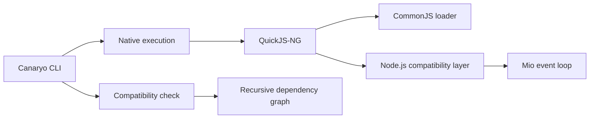

<table align="center">
  <tr>
    <td align="center" bgcolor="#0d1117">
      
    </td>
  </tr>
</table>

<h1 align="center">Canaryo</h1>

<p align="center">
  <strong>A lightweight JavaScript runtime for existing Node.js HTTP applications.</strong>
</p>

<p align="center">
  <code>node server.js</code> → <code>canaryo server.js</code>
</p>

<p align="center">
  
  
  
</p>

Canaryo embeds QuickJS-NG in a Rust executable and recreates the Node.js APIs needed by HTTP applications. Its goal is to run existing projects without source changes while reducing startup time and memory usage.

Canaryo 0.1.0 is an experimental runtime. Basic `node:http`, Express 5.2.1, and Fastify 5.12.3 applications work natively; broader Node.js compatibility is under active development.

## Why Canaryo?

- **Existing code first:** run supported CommonJS applications without rewriting them.
- **Small memory footprint:** the current Express fixture uses about 10.4 MiB of resident memory with 16 persistent connections.
- **Fast startup:** native HTTP starts in about 10 ms and the tested Express application starts faster than Node.js on the benchmark machine.
- **Compatibility report:** inspect an entry point and its dependencies before execution.
- **Explicit escape hatch:** delegate to the installed Node.js runtime when necessary.

## Quick start

Install Canaryo from this checkout:

```sh
cargo install --path .
```

Install your application's packages, inspect compatibility, and run it:

```sh
npm install
canaryo check server.js
canaryo server.js
```

A minimal server needs no Canaryo-specific code:

```js
const http = require("node:http");

http.createServer((_request, response) => {
    response.end("Hello from Canaryo!");
}).listen(3000);
```

The supported Fastify subset also uses the framework's regular API:

```js
const fastify = require("fastify")();

fastify.get("/", async () => ({ hello: "world" }));
fastify.listen({ port: 3000, host: "127.0.0.1" });
```

## CLI

| Command | Purpose |
|---|---|
| `canaryo <file> [args...]` | Run a JavaScript entry point with the native runtime. |
| `canaryo run <file> [args...]` | Explicit form of the native run command. |
| `canaryo check <file>` | Analyze local and package dependencies recursively. |
| `canaryo run --node <file> [args...]` | Run through the installed Node.js executable. |
| `canaryo --version` | Print the Canaryo version. |

Execution starts directly for low startup overhead. Use `canaryo check` in development or CI when you want the complete compatibility report.

## Performance

Results collected on Windows 11 with an AMD Ryzen 5 5600X, Node.js 22.15.1, and a release build of Canaryo 0.1.0. Every load result is the median of three 3-second samples after warm-up; all measured requests completed without errors.

### Startup latency

Lower is better.

| Application | Node.js | Canaryo | Canaryo improvement |
|---|---:|---:|---:|
| `node:http` | 54.83 ms | **21.55 ms** | **60.7% lower** |
| Express 5.2.1 | 218.57 ms | **178.58 ms** | **18.3% lower** |
| Fastify 5.12.3 | 361.39 ms | **213.63 ms** | **40.9% lower** |

### Throughput at concurrency 16

Higher is better. “New connection” opens a TCP connection for every request; “keep-alive” reuses one connection per worker.

| Application | New connection: Node.js | New connection: Canaryo | Difference | Keep-alive: Node.js | Keep-alive: Canaryo | Difference |
|---|---:|---:|---:|---:|---:|---:|
| `node:http` | 4,971 req/s | **7,569 req/s** | **+52.3%** | 21,421 req/s | **28,341 req/s** | **+32.3%** |
| Express 5.2.1 | 2,279 req/s | **3,211 req/s** | **+40.9%** | 6,318 req/s | **6,476 req/s** | **+2.5%** |
| Fastify 5.12.3 | 4,166 req/s | **5,119 req/s** | **+22.9%** | **20,528 req/s** | 12,950 req/s | **−36.9%** |

### Resident memory at concurrency 16

Lower is better. RSS is sampled from the runtime process during the selected throughput run.

| Application | New connection: Node.js | New connection: Canaryo | Reduction | Keep-alive: Node.js | Keep-alive: Canaryo | Reduction |
|---|---:|---:|---:|---:|---:|---:|
| `node:http` | 40.2 MiB | **11.7 MiB** | **70.9%** | 39.1 MiB | **7.1 MiB** | **81.8%** |
| Express 5.2.1 | 62.2 MiB | **10.6 MiB** | **83.0%** | 90.4 MiB | **10.3 MiB** | **88.6%** |
| Fastify 5.12.3 | 51.9 MiB | **12.9 MiB** | **75.1%** | 53.9 MiB | **13.3 MiB** | **75.3%** |

Canaryo currently leads startup and memory use in every tested application. It also leads throughput when requests reopen connections, and leads `node:http` and Express with persistent connections at concurrency 16. Persistent Fastify traffic remains the main performance gap because its JavaScript-heavy request path benefits from V8's optimizing JIT.

These synthetic loopback results cover the current compatibility surface on one machine. See [BENCHMARKS.md](BENCHMARKS.md) for latency percentiles, concurrency 1 results, methodology, limitations, and reproduction commands.

## How it works



- `src/runtime.rs` creates the JavaScript context, loads CommonJS, and caches resolutions.
- `src/modules.rs` implements Node-style file and package resolution.
- `src/http.rs` maps `node:http` calls to a non-blocking Rust event loop.
- `src/polyfills.js` provides the JavaScript-facing compatibility layer.
- `src/analyzer.rs` powers the recursive `check` command.

## Compatibility

| Area | Status | Current scope |
|---|---|---|
| CommonJS | Supported | Relative modules, JSON, package `main` and `exports`, conditional and wildcard exports, scoped packages, cache, upward `node_modules` lookup, and common `node:module` helpers. |
| `node:http` | Partial | Non-blocking `listen()` registration, server creation and shutdown, persistent HTTP/1.1 connections, pipelining, content-length and chunked request bodies, trailers, binary payloads, `HEAD`, socket metadata, response lifecycle events, custom status messages, header introspection, `write`, and `end`. |
| Express | Partial | Express 5.2.1 startup, basic routing, JSON request parsing, and JSON responses. |
| Fastify | Partial | Fastify 5.12.3 startup, parameterized routes, query strings, request/response hooks, JSON request parsing, async handlers, timed handlers, and JSON responses. Plugin compatibility varies with the Node.js APIs each plugin uses. |
| Promises and timers | Partial | Promise jobs, `AsyncResource`, `process.nextTick`, `queueMicrotask`, `setImmediate`, `setTimeout`, and `setInterval` in the native HTTP event loop. Standalone event-loop lifetime and timer handle behavior remain incomplete. |
| Process | Partial | Arguments, environment, cwd, executable path, PID, platform/architecture/version metadata, process events, warnings, uptime, `hrtime`, resource-shape methods, and built-in module lookup. Signals, IPC, privilege APIs, and exact resource accounting remain incomplete. |
| Events | Partial | Listener ordering, one-time and prepended listeners, removal, introspection, unhandled errors, and Promise-based `events.once`. AbortSignal integration and rejection capture remain incomplete. |
| URLs | Partial | Global and `node:url` `URL`/`URLSearchParams`, repeated query parameters, relative HTTP URLs, and basic file URL conversion. IDNA, complete percent-encoding rules, and every legacy URL edge case remain incomplete. |
| DNS and IP utilities | Partial | System-backed `dns.lookup`, IPv4/IPv6 filtering, all-results and Promise forms, basic `resolve4`/`resolve6`, result ordering, and `net.isIP` helpers. Full DNS record types, custom resolvers, and TCP/IPC sockets remain incomplete. |
| Operating system APIs | Partial | Host platform, architecture, type, endianness, home/temp directories, hostname, CPU parallelism, user shape, EOL, and uptime. Exact CPU, memory, release, network-interface, and OS constants data remain incomplete. |
| Path APIs | Partial | Platform-correct default `node:path`, separate Win32/POSIX implementations, normalization, joining, resolution, relative paths, parsing, formatting, and basename/dirname/extension helpers. Namespace and uncommon drive-relative/UNC edge cases remain incomplete. |
| Buffers and streams | Partial | Buffer encodings and common binary operations; functional in-memory `Readable`, `Writable`, `Duplex`, `Transform`, `PassThrough`, `pipe`, `pipeline`, and `finished`; plus request body events. Complete backpressure, async iteration, filesystem streams, and advanced Buffer methods remain incomplete. |
| Filesystem APIs | Partial | Buffer-aware read, write, append, stat, exists, access, mkdir, and readdir operations through synchronous, callback, and `fs/promises` APIs. Streams, watches, links, permissions, and file descriptors remain incomplete. |
| ESM | Partial | Native `.mjs` and `type: module` execution, relative imports, package `import` conditions, JSON loading, named imports from common built-ins, default CommonJS interop, and static detection of `exports.name`. Dynamic CJS exports and some Node resolution rules remain incomplete. |
| Keep-alive | Supported | Connections persist by default on HTTP/1.1 and honor `Connection: close`. |
| TLS | Planned | HTTPS sockets and certificates are not available yet. |
| Native `.node` addons | Unsupported | Native Node.js ABI modules cannot be loaded. |

`canaryo check` reports one of three project-level outcomes:

- **Compatible:** no unsupported API was detected.
- **Compatible with limitations:** the application uses an API with partial support.
- **Incompatible:** the application requires functionality the runtime cannot execute.

## Development

Run the complete validation suite:

```sh
npm ci --prefix fixtures/express-basic
npm ci --prefix fixtures/fastify-basic
cargo fmt --check
cargo clippy --all-targets -- -D warnings
cargo test
cargo test --test runtime_smoke -- --ignored
```

Reproduce the performance comparison:

```sh
cargo build --release
cargo bench --bench runtime -- --duration 3 --runs 3 --startup-runs 7
cargo bench --bench runtime -- --keep-alive --duration 3 --runs 3 --startup-runs 7
```

Add `--case fastify`, `--case express`, or `--case node:http` to isolate one application while investigating performance.

Use `--startup-only` while working specifically on initialization:

```sh
cargo bench --bench runtime -- --startup-only --startup-runs 15
```

## Roadmap

- Connection timeouts, limits, backpressure, and graceful shutdown.
- Streaming request and response bodies.
- Additional asynchronous I/O sources and complete timer lifecycle behavior.
- Wider Buffer, stream, filesystem, crypto, and networking support.
- Complete ESM/CommonJS interop and the remaining Node package-resolution rules.
- A larger Express, Fastify, and plugin compatibility suite.
- TLS, workers, diagnostics, and production observability.

## License

Canaryo is available under the [MIT License](LICENSE).
